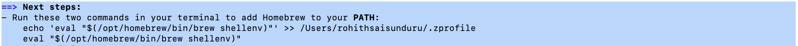

This guide is segregated into 3 main parts. 
1. The first part of the guide talks about installing the MySQL database, MySQL WB and finally running the sql scripts required for the ecommerce project. 
2. The second part talks about running the Spring Boot E-Commerce App.
3. The third part talks about running the Angular Frontend E-Commerce App.

**Running MySQL Server:**
1. Download the source code attached to lecture 217 and extract the directory from the zip.
2. Open 01-starter-files directory. Lets run the scripts under the `01-starter-files/db-scripts` directory. To run those scripts and look at the results later, you have to install a mysql client on your machine. So, We will install MySQL Workbench.
3. Download [homebrew](https://brew.sh/). homebrew is a missing software manager for Mac/Linux. At the end of the brew installation, make sure you run the two commands to add Homebrew to `PATH`.
   

4. Download MySQL community server using `brew install mysql`. Once you have `mysql` installed on your machine, you can start it by running `mysql.server start` and stop it by running `mysql.server stop` from the terminal.
5. Now, inorder to run those starter sql scripts under `01-starter-files/db-scripts` , lets install MySQL Workbench. Download MySQL Workbench using `brew install --cask mysqlworkbench`. Before you open the Workbench, make sure you start the mysql server using `mysql.server start`.
6. Open your Workbench now, click on the root instance. Now, to run all the sql scripts, open all the SQL scripts on by one by clicking on `File` and `Open SQL Script`. and execute them by clicking on ⚡️.
 

**Running the Spring Boot App:**
1. Install jdk on your machine, `brew install openjdk@11` Make sure you export the openjdk to your `PATH`. Once done, do `java --version` which should give you the java version.
   
2. Now, `cd` into `02-backend/spring-boot-ecommerce`. Once you're inside, Please change the java version to 11 in pom.xml and run `./mvnw clean install`. This might take a couple minutes. 
3. Now, to start your application run `./mvnw spring-boot:run`. This will run your backend application. Once your application is up, go hit `http://localhost:8080/api/` on your browser and you should see something as follows:
   

**Running the Angular App:**
1.  Install node on your machine using brew `brew install node@16`.
2. `node -v` && `npm -v` on your machine should give you their respective version numbers.
3. Install the angular-cli, `npm install -g @angular/cli`.`ng version` should give you the angular-cli version number.
3. Now, navigate to our front-end app at `03-frontend/angular-ecommerce`. Once you're inside the `angular-ecommerce` directory, run `npm install`.
4. Now, run `ng build` (this might take a couple minutes). Finally, `ng serve`.
5. You should have a fully functional ecommerce app up and running at `http://localhost:4200`. 

**Note:** 
1. Make sure to start your mysql sever and your springboot backend app. 
2. To stop your frontend and backend apps from terminal, hit `ctrl + z`.
   1. `lsof -i:PORT`. Here `PORT` can be either `4200` or `8080`.
   2. `kill -9 PID`. Here `PID` is the process id you get from running the above command.

	