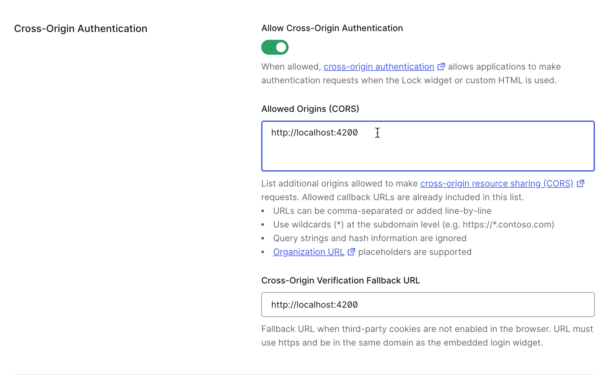

# Security Login/Logout - Auth0 Integration Tutorial  

## Introduction

In this tutorial, you will learn how to integrate Auth0 into an eCommerce application.

Users can sign up or log in (including social login).

## Prerequisites

This tutorial assumes that you have already completed the section **“eCommerce Project – Checkout Form – Save the Order to Database”** in the *Full Stack Angular Spring Boot Tutorial* course.

## Overview of Steps

1. Create a developer account on Auth0  
2. Create Application and provide Application Information  
3. Create API  
4. Install Auth0 dependencies  
5. Create/Update `my-app-config.ts`  
6. Add Login Status Component  
7. Update `app.module.ts`  
8. Add `auth-interceptor.service.ts`  
9. Spring Boot – Backend Changes  
10. Run the Application  


## 1. Create a Developer Account on Auth0

### SIGN UP
1. Open: [https://developer.auth0.com/](https://developer.auth0.com/)  
2. Sign up.


## 2. Create an Application on Auth0 and Provide App Information

### Create Application
1. In Auth0 Developer Account, select `Applications > + Create Application`  
2. Name: `My Angular App`  
3. Choose `Single Page Applications`  
4. Click Create

**PROVIDE APP INFORMATION**  
Add Application URIs:  

- **Allowed Callback URLs**: `http://localhost:4200/login/callback`  
- **Allowed Logout URLs**: `http://localhost:4200`  
- **Allowed Web Origins**: `http://localhost:4200`  
- **Allowed Origins (CORS)**: `http://localhost:4200`  




Click *Save*

## 3. Create API

**CREATE API**  
1. In Auth0 Developer Account, select `Applications > API > + Create API`  
2. Name: `My Spring Boot App`  
3. Identifier: `http://localhost:8080`  
4. Click Create


## 4. Install Auth0 Dependencies

**Run the following command** in the Angular app console:  

```bash
npm install @auth0/auth0-angular
```


## 5. Create/Update `my-app-config.ts`

```ts
export default {
  auth: {
    domain: "<<UPDATE-WITH-YOUR-DEV-DOMAIN>>",
    clientId: "<<UPDATE-WITH-YOUR-APP-CLIENT-ID>>",
    authorizationParams: {
      redirect_uri: "http://localhost:4200",
      audience: "http://localhost:8080",
    },
  },
  httpInterceptor: {
    allowedList: [
      'http://localhost:8080/api/orders/**',
      'http://localhost:8080/api/checkout/purchase'
    ],
  },
}
```


## 6. Add Login Status Component

Generate component:

```bash
ng generate component components/login-status
```

**File: `login-status.component.ts`**

```ts
import { DOCUMENT } from '@angular/common';
import { Component, Inject } from '@angular/core';
import { AuthService } from '@auth0/auth0-angular';

@Component({
  selector: 'app-login-status',
  templateUrl: './login-status.component.html',
  styleUrl: './login-status.component.css'
})
export class LoginStatusComponent {
  isAuthenticated: boolean = false;
  profileJson: string | undefined;
  userEmail: string | undefined;
  storage: Storage = sessionStorage;

  constructor(private auth: AuthService, @Inject(DOCUMENT) private doc: Document) {}

  ngOnInit(): void {
    this.auth.isAuthenticated$.subscribe((authenticated: boolean) => {
      this.isAuthenticated = authenticated;
      console.log('User is authenticated: ', this.isAuthenticated);
    });

    this.auth.user$.subscribe((user) => {
      this.userEmail = user?.email;
      this.storage.setItem('userEmail', JSON.stringify(this.userEmail));
      console.log('User ID: ', this.userEmail);
    });
  }

  login() {
    this.auth.loginWithRedirect();
  }

  logout(): void {
    this.auth.logout({ logoutParams: { returnTo: this.doc.location.origin } });
  }
}
```

## 7. Update `app.module.ts`

Update `app.module.ts` with the following additions:

```ts
import { AuthGuard, AuthHttpInterceptor, AuthModule } from '@auth0/auth0-angular';
import myAppConfig from './config/my-app-config';
import { AuthInterceptorService } from './services/auth-interceptor.service';

@NgModule({
  ...
  imports: [
    ...
    AuthModule.forRoot({
      ...myAppConfig.auth,
      httpInterceptor: {
        ...myAppConfig.httpInterceptor,
      },
    }),
  ],
  providers: [
    ProductService,
    {
      provide: HTTP_INTERCEPTORS,
      useClass: AuthInterceptorService,
      multi: true,
    },
  ],
  ...
})
export class AppModule { }
```

## 8. Add `auth-interceptor.service.ts`

Generate service:

```bash
ng generate service services/auth-interceptor
```

**File: `auth-interceptor.service.ts`**

```ts
import {
  HttpEvent,
  HttpHandler,
  HttpInterceptor,
  HttpRequest,
} from '@angular/common/http';
import { Injectable } from '@angular/core';
import { AuthService } from '@auth0/auth0-angular';
import { from, lastValueFrom, Observable } from 'rxjs';

@Injectable({ providedIn: 'root' })
export class AuthInterceptorService implements HttpInterceptor {
  constructor(private auth: AuthService) {}

  intercept(request: HttpRequest<any>, next: HttpHandler): Observable<HttpEvent<any>> {
    return from(this.handleAccess(request, next));
  }

  private async handleAccess(request: HttpRequest<any>, next: HttpHandler): Promise<HttpEvent<any>> {
    const securedEndpoints = ['http://localhost:8080/api/orders'];

    if (securedEndpoints.some((url) => request.urlWithParams.includes(url))) {
      await this.auth.getAccessTokenSilently().forEach((token) => {
        console.log('Access Token: ', token);
        request = request.clone({
          setHeaders: {
            Authorization: `Bearer ${token}`,
          },
        });
      });
    }

    return await lastValueFrom(next.handle(request));
  }
}
```


## 9. Spring Boot – Backend Changes

**File: `application.properties`**

```properties
## issuer url must ends with "/"
okta.oauth2.issuer=https://<<UPDATE-WITH-YOUR-DOMAIN-NAME>>/
okta.oauth2.client-id=<<UPDATE-WITH-YOUR-APP-CLIENT-ID>>
okta.oauth2.audience=http://localhost:8080
```


## 10. Run the Application

1. Sign up using email or social login  
2. Verify member and orders  
3. Logout  

---

© luv2code LLC  
[www.luv2code.com](http://www.luv2code.com)