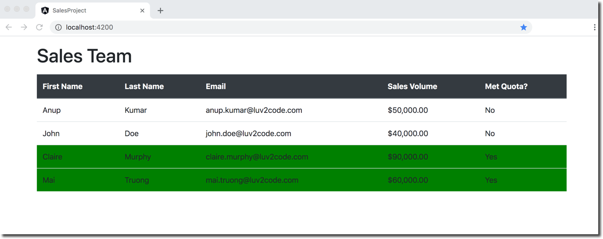

# Angular Conditionals: How to highlight table row

## Question

We have learned we can display condition value for Met Quota column by ngIf. If I wanted to highlighted complete row as background color green which has sales volume 60000 or more. How can I accomplish this task?

## Answer

Good question! Yes, we can develop code to accomplish this task.



----

## Development Process
1. Create a local CSS style for Green
2. Update HTML to apply style to row

---
### 1. Create a local CSS style for Green

In the CSS file for your component, you can create a local CSS style. This is setting the background color of an element to green.


File: **sales-person-list.component.css**
```css
    .highlight {
      background-color:green
    }
```

### 2. Update HTML to apply style to row

In your component, you can make use of `[ngClass]` to conditionally apply styles to an element.

The basic syntax is:
```html
    <div [ngClass]="{
       'class1': condition  (the true condition),
       'class2': !condition (else)
    }">
```

In our example, we will use the `[ngClass]`. This will give a green background for the entire row for a sales person whose `quota is >= 60000`.

File: **sales-person-list-bootstrap.component.html**
```html
        <tr *ngFor="let tempSalesPerson of salesPersonList" [ngClass]="{'highlight': tempSalesPerson.salesVolume >= 60000}">
            <td>{{ tempSalesPerson.firstName }}</td>
            <td>{{ tempSalesPerson.lastName }}</td>
            <td>{{ tempSalesPerson.email }}</td>
            <td>{{ tempSalesPerson.salesVolume | currency:'USD'}}</td>

            <td>
                <div *ngIf="tempSalesPerson.salesVolume >= 60000; else myElseBlock">Yes</div>
                <ng-template #myElseBlock>No</ng-template>
            </td>
        </tr>
```

Also, remove the `table-hover` style from your `<table ...>` tag. This will prevent the rows from changing colors when you hover over them.

The final code for [sales-person-list-bootstrap.component.html](code/sales-person-list-bootstrap.component.html) should resemble the one below:

```html
<table class="table">

    <thead class="table-dark">
        <tr>
            <th>First Name</th>
            <th>Last Name</th>
            <th>Email</th>
            <th>Sales Volume</th>
            <th>Met Quota?</th>
        </tr>
    </thead>

    <tbody>
        <tr *ngFor="let tempSalesPerson of salesPersonList" [ngClass]="{'highlight': tempSalesPerson.salesVolume >= 60000}">
            <td>{{ tempSalesPerson.firstName }}</td>
            <td>{{ tempSalesPerson.lastName }}</td>
            <td>{{ tempSalesPerson.email }}</td>
            <td>{{ tempSalesPerson.salesVolume | currency:'USD'}}</td>

            <td>
                <div *ngIf="tempSalesPerson.salesVolume >= 60000; else myElseBlock">Yes</div>
                <ng-template #myElseBlock>No</ng-template>
            </td>
        </tr>

    </tbody>

</table>
```

---
## Verify the Results

Once you run your application, then you will see the desired output.


**Congratulations!**
