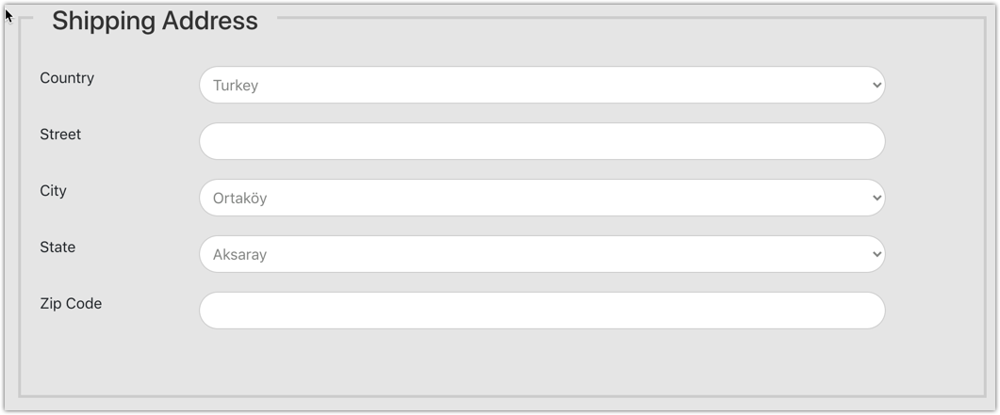
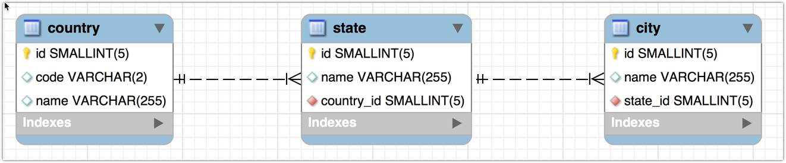
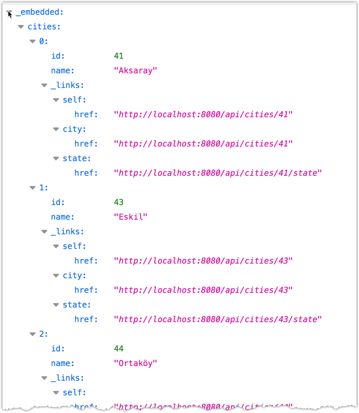

# Checkout Form - Drop-down list for Cities

## Question

In the checkout form, can you show how to add a drop-down list for cities? **Country -> State -> City**.

## Answer

Good question! Based on the videos presented, we can extend the example to also have a City drop-down list. 

### Screenshot
Here is a screenshot of the final solution. Make note of the drop-down list for cities.



## Data for Cities

A challenge with this project is that you would need to have a list of all cities for your database grouped by state. Unfortunately, I don't have access to this data for every country/state. 

However, I will show an example using a subset of data for some of the states in Turkey and the U.S. Feel free to add more data to the database for your desired countries/states.

Here is a subset of the data that I'm using for Turkey and the U.S. 
- Five states for Turkey and the U.S.
- Five cities for each state

### Turkey
|State|City|
|:-:|:-:|
|Adıyaman|Adıyaman|
|Adıyaman|Besni|
|Adıyaman|Çelikhan|
|Adıyaman|Kahta|
|Adıyaman|Gölbaşı|
|Afyonkarahisar|Afyon|
|Afyonkarahisar|Bolvadin|
|Afyonkarahisar|Çay|
|Afyonkarahisar|Dinar|
|Afyonkarahisar|Emirdağ|
|Ağrı|Ağrı|
|Ağrı|Diyadin|
|Ağrı|Doğubayazıt|
|Ağrı|Eleşkirt|
|Ağrı|Patnos|
|Aksaray|Aksaray|
|Aksaray|Eskil|
|Aksaray|Ortaköy|
|Aksaray|Sultanhanı|
|Amasya|Amasya|
|Amasya|Gümüşhacıköy|
|Amasya|Merzifon|
|Amasya|Suluova|
|Amasya|Taşova|

---

### United States
|State|City|
|:-:|:-:|
|Alabama|Birmingham|
|Alabama|Huntsville|
|Alabama|Mobile|
|Alabama|Montgomery|
|Alabama|Tuscaloosa|
|Alaska|Anchorage|
|Alaska|Fairbanks|
|Alaska|Juneau|
|Alaska|Ketchikan|
|Alaska|Sitka|
|Arizona|Chandler|
|Arizona|Glendale|
|Arizona|Mesa|
|Arizona|Phoenix|
|Arizona|Tucson|
|Arkansas|Fayetteville|
|Arkansas|Fort Smith|
|Arkansas|Jonesboro|
|Arkansas|Little Rock|
|Arkansas|Springdale|
|California|Los Angeles|
|California|Oxnard|
|California|Sacramento|
|California|San Diego|
|California|San Francisco|

---

### Overview of Development Process - Backend
1. Create database tables
2. Create JPA Entity class for City
3. Add relationship to State JPA Entity class
4. Create Spring Data Repository for CityRepository
5. Update Spring Data REST configs


### Overview of Development Process - Frontend
1. Create TypeScript class for City
2. Add methods to the form service for cities
3. Update checkout component to retrieve the cities from service
4. Add event handler for checkout component
5. Update HTML template to populate drop-down list of cities based on selected states
6. Update code for copyShippingAddressToBillingAddress

----
## Development Process - Backend

### 1. Create database tables

We first need to create the database tables. This will have a new table for city. Each city is has a foreign key for the respective state.

Here is the database diagram.



Here is the [link to the SQL script](code/01-starter-files/db-scripts/countries-and-states-and-cities-TURKEY-AND-US.sql) 


### 2. Create JPA Entity class for City

    package com.luv2code.ecommerce.entity;

    import lombok.Data;

    import javax.persistence.*;

    @Entity
    @Table(name="city")
    @Data
    public class City {

        @Id
        @GeneratedValue(strategy = GenerationType.IDENTITY)
        @Column(name="id")
        private int id;

        @Column(name="name")
        private String name;

        @ManyToOne
        @JoinColumn(name="state_id")
        private State state;

    }

### 3. Add relationship to State JPA Entity class

    package com.luv2code.ecommerce.entity;

    import com.fasterxml.jackson.annotation.JsonIgnore;
    import lombok.Data;

    import javax.persistence.*;
    import java.util.List;

    @Entity
    @Table(name="state")
    @Data
    public class State {

        @Id
        @GeneratedValue(strategy = GenerationType.IDENTITY)
        @Column(name="id")
        private int id;

        @Column(name="name")
        private String name;

        @ManyToOne
        @JoinColumn(name="country_id")
        private Country country;

        @OneToMany(mappedBy = "state")
        @JsonIgnore
        private List<City> cities;

    }

### 4. Create Spring Data Repository for CityRepository

    package com.luv2code.ecommerce.dao;

    import com.luv2code.ecommerce.entity.City;
    import org.springframework.data.jpa.repository.JpaRepository;
    import org.springframework.data.repository.query.Param;
    import org.springframework.data.rest.core.annotation.RepositoryRestResource;
    import org.springframework.web.bind.annotation.CrossOrigin;

    import java.util.List;

    @CrossOrigin("http://localhost:4200")
    @RepositoryRestResource(collectionResourceRel = "cities", path = "cities")
    public interface CityRepository extends JpaRepository<City, Integer> {

        List<City> findByStateId(@Param("id") Integer id);

    }


### 5. Update Spring Data REST configs

        @Override
        public void configureRepositoryRestConfiguration(RepositoryRestConfiguration config) {

            HttpMethod[] theUnsupportedActions = {HttpMethod.PUT, HttpMethod.POST, HttpMethod.DELETE};

            // disable HTTP methods for ProductCategory: PUT, POST and DELETE
            disableHttpMethods(Product.class, config, theUnsupportedActions);
            disableHttpMethods(ProductCategory.class, config, theUnsupportedActions);
            disableHttpMethods(Country.class, config, theUnsupportedActions);
            disableHttpMethods(State.class, config, theUnsupportedActions);
            disableHttpMethods(City.class, config, theUnsupportedActions);

            // call an internal helper method
            exposeIds(config);
        }

### 6. Test the app

Start your Spring Boot application. 

Then open the following URL in a browser.
- http://localhost:8080/api/cities/search/findByStateId?id=147

This will give you a list of cities for the Turkish state **Aksaray**




## Development Process - Frontend

### 1. Create TypeScript class for City

1. Generate class using Angular CLI

    ```
    $ ng generate class common/City
    ```

2. Add this code to the class.

    ```
    export class City {
        id: number;
        name: string;
    }
    ```

### 3. Add methods to the form service for cities


1. Edit Luv2ShopFormService

1. Add cities url
    ```
    private citiesUrl = 'http://localhost:8080/api/cities';
    ```

1. Add method: getCities(...)
    ```
    getCities(theStateId: number): Observable<State[]> {

        // search url
        const searchCitiesUrl = `${this.citiesUrl}/search/findByStateId?id=${theStateId}`;

        return this.httpClient.get<GetResponseCities>(searchCitiesUrl).pipe(
        map(response => response._embedded.cities)
        );
    }
    ```

1. Add interface for the response
    ```
    interface GetResponseCities {
    _embedded: {
        cities: City[];
    }
    }
    ```

### 4. Update checkout component to retrieve the cities from service

    getCities(formGroupName: string) {

        const formGroup = this.checkoutFormGroup.get(formGroupName);

        const stateId = formGroup.value.state.id;
        const stateName = formGroup.value.state.name;

        console.log(`${formGroupName} state id: ${stateId}`);
        console.log(`${formGroupName} state name: ${stateName}`);

        this.luv2ShopFormService.getCities(stateId).subscribe(
        data => {

            if (formGroupName === 'shippingAddress') {
            this.shippingAddressCities = data; 
            }
            else {
            this.billingAddressCities = data;
            }

            // select first item by default
            formGroup.get('city').setValue(data[0]);
        }
        );
    }

### 5. Add event handler for checkout component

                    <div class="row">
                        <div class="col-md-2"> <label>State</label></div>
                        <div class="col-md-9">
                            <div class="input-space">
                                <select formControlName="state" (change)="getCities('shippingAddress')">
                                    <option *ngFor="let state of shippingAddressStates" [ngValue]="state">
                                        {{ state.name }}
                                    </option>
                                </select>
                            </div>
                        </div>
                    </div>


### 6. Update HTML template to populate drop-down list of cites based on selected state

                    <div class="row">
                        <div class="col-md-2"> <label>City</label></div>
                        <div class="col-md-9">
                            <div class="input-space">
                                <select formControlName="city">
                                    <option *ngFor="let city of shippingAddressCities" [ngValue]="city">
                                        {{ city.name }}
                                    </option>
                                </select>
                            </div>
                        </div>
                    </div>

> *NOTE: Repeat steps 5 and 6 for Billing Address.*

### 7. Update code for copyShippingAddressToBillingAddress

```
  copyShippingAddressToBillingAddress(event) {

    if (event.target.checked) {
      this.checkoutFormGroup.controls.billingAddress
            .setValue(this.checkoutFormGroup.controls.shippingAddress.value);

            this.billingAddressStates = this.shippingAddressStates;
            this.billingAddressCities = this.shippingAddressCities;
    }
    else {
      this.checkoutFormGroup.controls.billingAddress.reset();

      this.billingAddressStates = [];
      this.billingAddressCities = [];
    } 
  }
```

## Verify the Results

Now when you run the application, the checkout form will have a drop-down list for cities. The cities will be populated based on the selected state.


**Congratulations!**


### Source Code

The source code is [available at this link.](code/) 
